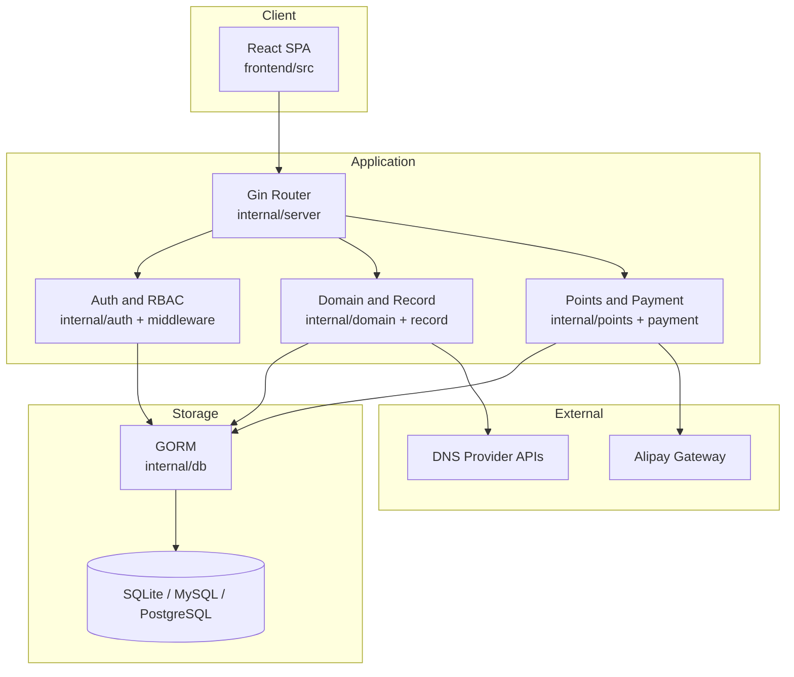
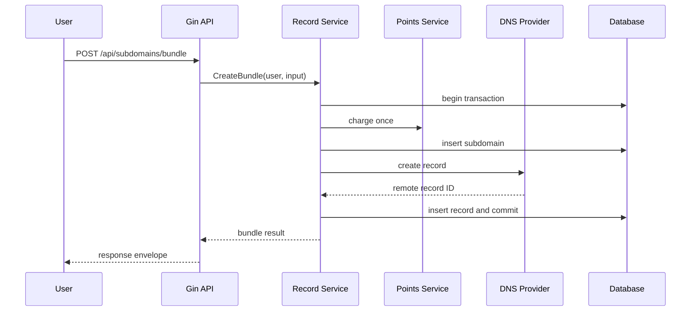

# 架构设计

> **Status**: release-ready  
> **Audience**: developer, architect, operator  
> **Scope**: TuDNS 运行时层次、关键流程和架构风险  
> **Last verified**: 2026-07-17 against working tree  
> **Owners**: TuDNS maintainers  
> **Related docs**: [项目概览](project-overview.md)、[数据存储](data-storage.md)

<cite>
**Files Referenced in This Document**
- [main.go](file://cmd/server/main.go) - 进程生命周期
- [router.go](file://internal/server/router.go) - 服务装配与路由
- [record service](file://internal/record/service.go) - 主业务流
- [db.go](file://internal/db/db.go) - 持久化
</cite>

## Table of Contents
1. [Introduction](#introduction)
2. [Evidence Map](#evidence-map)
3. [Project Structure](#project-structure)
4. [Core Components](#core-components)
5. [Architecture Overview](#architecture-overview)
6. [Detailed Component Analysis](#detailed-component-analysis)
7. [Dependency and Boundary Analysis](#dependency-and-boundary-analysis)
8. [Data and Control Flow](#data-and-control-flow)
9. [Security and Reliability](#security-and-reliability)
10. [Performance and Capacity](#performance-and-capacity)
11. [Conclusion](#conclusion)

## Introduction

架构目标是用一个可执行文件承载 SPA、API 和业务服务，同时通过接口隔离 DNS 服务商差异。系统是模块化单体，不是微服务。

**Section Sources**
- [embed.go](file://internal/webembed/embed.go) - line range not verified
- [provider.go](file://internal/dns/provider.go) - line range not verified

## Evidence Map

| Topic | Primary evidence | What it proves |
| --- | --- | --- |
| 启停 | [main.go](file://cmd/server/main.go) | 超时、信号和优雅关闭 |
| 服务装配 | [router.go](file://internal/server/router.go) | App 服务依赖关系 |
| DNS 抽象 | [provider.go](file://internal/dns/provider.go) | Provider 统一接口与注册表 |
| 事务 | [service.go](file://internal/record/service.go) | 扣费、本地记录和外部调用顺序 |

## Project Structure

代码按进程入口、私有包、前端和生成资产分层；领域服务直接使用 GORM，没有独立 repository 层。

**Section Sources**
- [router.go](file://internal/server/router.go) - line range not verified

## Core Components

**Diagram Sources**
- [router.go](file://internal/server/router.go) - line range not verified
- [db.go](file://internal/db/db.go) - line range not verified
- [provider.go](file://internal/dns/provider.go) - line range not verified

**Section Sources**
- [router.go](file://internal/server/router.go) - line range not verified

## Architecture Overview

HTTP 层统一装配 recovery、日志、CORS 和安全头。安装前只提供安装相关能力；安装后 App 在内存中装配 service。所有业务状态在关系数据库，外部 DNS 是事实上的第二状态源。

**Section Sources**
- [router.go](file://internal/server/router.go) - line range not verified

## Detailed Component Analysis

`cmd/server` 加载配置、按安装锁决定是否连接数据库、启动 HTTP 并监听终止信号。`server.App` 在安装后可不重启重新绑定服务。`dns.Provider` 规定配置、检查、Zone 列表和记录 CRUD；具体实现通过 `init` 注册。

**Section Sources**
- [main.go](file://cmd/server/main.go) - line range not verified
- [provider.go](file://internal/dns/provider.go) - line range not verified

## Dependency and Boundary Analysis

核心风险是数据库事务无法覆盖第三方 DNS。创建记录时远端成功而本地保存失败会尝试删除远端；删除子域时远端删除错误被忽略，可能遗留解析。补偿任务和对账机制目前不存在。

**Section Sources**
- [record service](file://internal/record/service.go) - line range not verified

## Data and Control Flow

**Diagram Sources**
- [record service](file://internal/record/service.go) - line range not verified
- [router.go](file://internal/server/router.go) - line range not verified

**Section Sources**
- [record service](file://internal/record/service.go) - line range not verified

## Security and Reliability

外部调用有 20-30 秒 context timeout；HTTP server 定义读取、写入和空闲超时并优雅关闭。未实现熔断、全局重试、任务队列或多实例协调。

**Section Sources**
- [main.go](file://cmd/server/main.go) - line range not verified
- [domain service](file://internal/domain/service.go) - line range not verified

## Performance and Capacity

数据库池上限为 25 个打开连接和 10 个空闲连接。没有基准或负载测试证据。SQLite 适合轻量单实例；高并发应先测量数据库锁竞争、Provider 延迟和前端包体，再决定扩容。

**Section Sources**
- [db.go](file://internal/db/db.go) - line range not verified

## Conclusion

模块化单体降低了部署复杂度，但上线前应优先解决外部 DNS 对账、真实集成验证和可观测性，而不是提前拆分微服务。

**Section Sources**
- [record service](file://internal/record/service.go) - line range not verified
