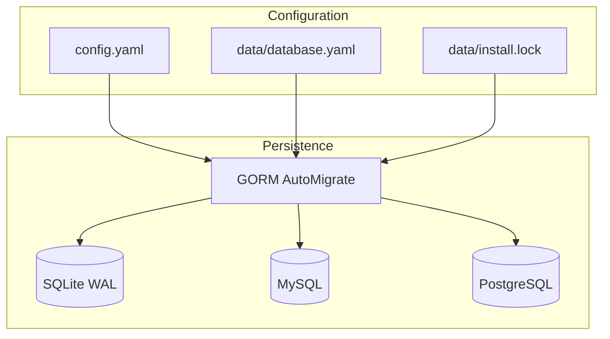

# 数据存储

> **Status**: release-ready  
> **Audience**: developer, operator  
> **Scope**: 数据库驱动、模型、迁移、持久化与恢复  
> **Last verified**: 2026-07-17 against working tree  
> **Owners**: TuDNS maintainers  
> **Related docs**: [运维](operations.md)、[安全](security.md)

<cite>
**Files Referenced in This Document**
- [db.go](file://internal/db/db.go) - 数据库连接和迁移
- [models.go](file://internal/models/models.go) - GORM 模型
- [config.go](file://internal/config/config.go) - 数据库配置文件
- [install service](file://internal/install/service.go) - 初始化流程
</cite>

## Table of Contents
1. [Introduction](#introduction)
2. [Evidence Map](#evidence-map)
3. [Project Structure](#project-structure)
4. [Core Components](#core-components)
5. [Architecture Overview](#architecture-overview)
6. [Detailed Component Analysis](#detailed-component-analysis)
7. [Dependency and Boundary Analysis](#dependency-and-boundary-analysis)
8. [Runtime Contracts](#runtime-contracts)
9. [Data and Control Flow](#data-and-control-flow)
10. [Configuration and Operations](#configuration-and-operations)
11. [Security and Reliability](#security-and-reliability)
12. [Performance and Capacity](#performance-and-capacity)
13. [Testing and Verification](#testing-and-verification)
14. [Conclusion](#conclusion)

## Introduction

TuDNS 使用 GORM 统一支持 SQLite、MySQL 和 PostgreSQL。数据库保存全部业务状态，`data/` 还保存安装锁和数据库连接配置。

**Section Sources**
- [db.go](file://internal/db/db.go) - line range not verified
- [config.go](file://internal/config/config.go) - line range not verified

## Evidence Map

| Topic | Primary evidence | What it proves |
| --- | --- | --- |
| 驱动 | [db.go](file://internal/db/db.go) | 三种 dialector 和连接池 |
| Schema | [models.go](file://internal/models/models.go) | 10 个业务模型 |
| 安装文件 | [config.go](file://internal/config/config.go) | `database.yaml` 和 `install.lock` |
| 空库要求 | [install service](file://internal/install/service.go) | 已有用户时拒绝安装 |

## Project Structure

数据库逻辑位于 `internal/db`，模型集中在 `internal/models`；项目没有 `migrations/` SQL 目录，迁移由启动时 `AutoMigrate` 完成。

**Section Sources**
- [db.go](file://internal/db/db.go) - line range not verified

## Core Components

| Model | Purpose | Key constraints |
| --- | --- | --- |
| User | 账号、角色、积分 | username unique |
| Domain | 上架根域与 Provider 密文 | name unique |
| Subdomain | 用户获得的二级域名 | full_domain unique |
| Record | 本地与远程记录映射 | remote_id |
| PointsLedger | 积分流水 | biz_no unique |
| RedeemCode / RedeemUse | 兑换码及使用记录 | code unique |
| PaymentOrder | 支付订单 | out_trade_no unique |
| Setting | 动态设置 | key unique |
| OperationLog | 管理操作记录 | indexed user/admin |

**Section Sources**
- [models.go](file://internal/models/models.go) - line range not verified

## Architecture Overview

**Diagram Sources**
- [config.go](file://internal/config/config.go) - line range not verified
- [db.go](file://internal/db/db.go) - line range not verified

**Section Sources**
- [db.go](file://internal/db/db.go) - line range not verified

## Detailed Component Analysis

SQLite 相对路径会归一化到 `data_dir` 并只保留 basename，连接串启用 WAL 和 5000ms busy timeout。连接池为最大 25 open、10 idle、1 小时 lifetime、30 分钟 idle time。

**Section Sources**
- [db.go](file://internal/db/db.go) - line range not verified

## Dependency and Boundary Analysis

MySQL/PostgreSQL DSN 属于敏感数据，保存在 `database.yaml`。数据库驱动差异由 GORM 抽象，但索引、类型和迁移行为仍可能不同，升级应在三种目标数据库中分别验证。

**Section Sources**
- [config.go](file://internal/config/config.go) - line range not verified

## Runtime Contracts

程序以 `install.lock` 判断是否安装，再加载 `database.yaml`。缺失锁时不打开数据库；锁存在但数据库不可用时启动失败或 readiness 返回失败。

**Section Sources**
- [main.go](file://cmd/server/main.go) - line range not verified
- [config.go](file://internal/config/config.go) - line range not verified

## Data and Control Flow

安装流程测试连接、执行 AutoMigrate、确认用户表为空、创建管理员与站点设置，然后写数据库配置和锁。锁写入失败可能留下已初始化数据库但未安装标记，需要人工检查后重试或清理空库。

**Section Sources**
- [install service](file://internal/install/service.go) - line range not verified

## Configuration and Operations

备份必须覆盖数据库、主配置、`database.yaml` 和 `install.lock`。升级前先在副本验证 AutoMigrate；当前没有版本化 migration 与自动降级脚本。

**Section Sources**
- [db.go](file://internal/db/db.go) - line range not verified

## Security and Reliability

数据库文件与 DSN 应只对服务账号可读。远程数据库必须使用私网/TLS 和最小权限；代码未自动强制 TLS 参数。不要在日志或 Issue 中粘贴 DSN。

**Section Sources**
- [config.go](file://internal/config/config.go) - line range not verified

## Performance and Capacity

没有数据库基准数据。SQLite 写并发受单文件模型约束；MySQL/PostgreSQL 的容量取决于外部实例和索引。上线前应按用户数、记录数、账本增长和查询分页执行压测。

**Section Sources**
- [models.go](file://internal/models/models.go) - line range not verified

## Testing and Verification

自动测试主要覆盖 service 逻辑，尚未发现针对三种数据库的矩阵集成测试。CI 当前只运行默认测试，不会启动 MySQL/PostgreSQL 服务。

**Section Sources**
- [ci.yml](file://.github/workflows/ci.yml) - line range not verified

## Conclusion

存储层适合开发和轻量部署；生产升级需要额外的 migration 管理、数据库矩阵测试和恢复演练。

**Section Sources**
- [db.go](file://internal/db/db.go) - line range not verified
