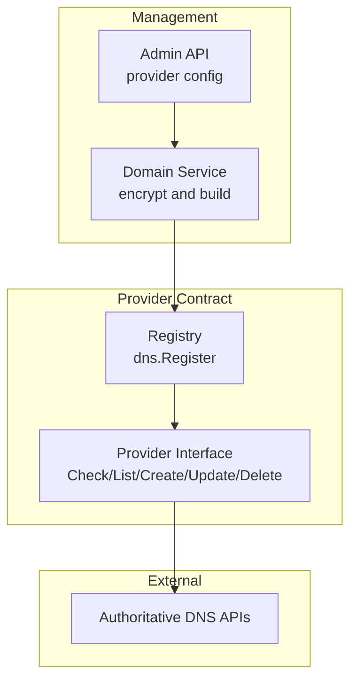

# DNS Provider 系统

> **Status**: release-ready  
> **Audience**: developer, integrator, operator  
> **Scope**: Provider 接口、注册实现、凭据和验证要求  
> **Last verified**: 2026-07-17 against working tree  
> **Owners**: TuDNS maintainers  
> **Related docs**: [架构](architecture.md)、[安全](security.md)

<cite>
**Files Referenced in This Document**
- [provider.go](file://internal/dns/provider.go) - Provider 契约
- [providers](file://internal/dns/providers) - 适配器目录
- [domain service](file://internal/domain/service.go) - 凭据与实例构造
- [record service](file://internal/record/service.go) - 调用方
</cite>

## Table of Contents
1. [Introduction](#introduction)
2. [Evidence Map](#evidence-map)
3. [Project Structure](#project-structure)
4. [Core Components](#core-components)
5. [Architecture Overview](#architecture-overview)
6. [Detailed Component Analysis](#detailed-component-analysis)
7. [Dependency and Boundary Analysis](#dependency-and-boundary-analysis)
8. [Runtime Contracts](#runtime-contracts)
9. [Configuration and Operations](#configuration-and-operations)
10. [Security and Reliability](#security-and-reliability)
11. [Testing and Verification](#testing-and-verification)
12. [Extension and Maintenance](#extension-and-maintenance)
13. [Conclusion](#conclusion)

## Introduction

Provider 层把不同服务商转换为统一 Zone 与记录 CRUD。注册不等于生产验证；当前所有平台仍需要真实凭据联调。

**Section Sources**
- [provider.go](file://internal/dns/provider.go) - line range not verified

## Evidence Map

| Topic | Primary evidence | What it proves |
| --- | --- | --- |
| 接口 | [provider.go](file://internal/dns/provider.go) | 方法和数据结构 |
| 注册 | [providers](file://internal/dns/providers) | 10 个实现 |
| 凭据保存 | [domain service](file://internal/domain/service.go) | 加密和配置实例化 |
| 业务调用 | [record service](file://internal/record/service.go) | 创建、更新和删除行为 |

## Project Structure

每个平台对应 `internal/dns/providers/<key>.go`；百度和火山另有 `_test.go`。平台通过包初始化注册，server 对 providers 做空白导入。

**Section Sources**
- [router.go](file://internal/server/router.go) - line range not verified
- [providers](file://internal/dns/providers) - line range not verified

## Core Components

| Key | 实现 | 当前证据 |
| --- | --- | --- |
| `aliyun` | `aliyun.go` | 编译、离线全套测试 |
| `baidu` | `baidu.go` | 官方 SDK、Provider 单测 |
| `cloudflare` | `cloudflare.go` | 编译、离线全套测试 |
| `dnsla` | `dnsla.go` | 编译、离线全套测试 |
| `dnspod` | `dnspod.go` | 编译、离线全套测试 |
| `huaweicloud` | `huaweicloud.go` | 编译、离线全套测试 |
| `jdcloud` | `jdcloud.go` | 编译、离线全套测试 |
| `volcengine` | `volcengine.go` | 官方 SDK、Provider 单测 |
| `westcn` | `westcn.go` | 编译、离线全套测试 |
| `xinnet` | `xinnet.go` | 编译、离线全套测试 |

**Section Sources**
- [providers](file://internal/dns/providers) - line range not verified

## Architecture Overview

**Diagram Sources**
- [provider.go](file://internal/dns/provider.go) - line range not verified
- [domain service](file://internal/domain/service.go) - line range not verified

**Section Sources**
- [provider.go](file://internal/dns/provider.go) - line range not verified

## Detailed Component Analysis

`ConfigFields` 驱动管理表单；`Configure` 验证凭据字段；`Check` 和 `ListZones` 用于上架前检测；记录操作接受标准化名称、类型、值、TTL 和线路。百度创建 API 不直接给 ID，适配器使用创建前后差集和短重试定位记录；火山更新缺少线路时先查询旧记录保留线路。

**Section Sources**
- [baidu.go](file://internal/dns/providers/baidu.go) - line range not verified
- [volcengine.go](file://internal/dns/providers/volcengine.go) - line range not verified

## Dependency and Boundary Analysis

Provider API、账号权限、区域、线路语义和 TTL 下限均由外部平台决定。适配器必须将平台错误传播给业务层，不应把网络成功等同于本地事务成功。

**Section Sources**
- [provider.go](file://internal/dns/provider.go) - line range not verified

## Runtime Contracts

统一接口要求 `Key`、`Label`、`ConfigFields`、`Configure`、`Check`、`ListZones`、`CreateRecord`、`UpdateRecord`、`DeleteRecord`。Zone 由远程 ID 和域名组成；远程记录 ID 必须持久化以支持后续更新和删除。

**Section Sources**
- [provider.go](file://internal/dns/provider.go) - line range not verified

## Configuration and Operations

使用专用测试账号和独立 Zone，权限只包含 Zone 列表与记录 CRUD。管理 API 检测成功后，再执行创建、读取平台控制台、更新、删除、确认消失的完整验证。密钥不得进入日志或文档。

**Section Sources**
- [domain service](file://internal/domain/service.go) - line range not verified

## Security and Reliability

凭据以主密钥加密存储，但调用时在内存解密。更换主密钥会破坏已有密文。网络调用有超时，但并非所有平台都有统一重试；生产应监控失败并进行外部状态对账。

**Section Sources**
- [domain service](file://internal/domain/service.go) - line range not verified
- [record service](file://internal/record/service.go) - line range not verified

## Testing and Verification

离线门槛是 `go test ./internal/dns/providers -count=1` 和 `go test ./... -count=1`。生产门槛必须增加每个平台的真实 CRUD；当前仓库没有可安全公开的真实凭据集成测试。

**Section Sources**
- [baidu_test.go](file://internal/dns/providers/baidu_test.go) - line range not verified
- [volcengine_test.go](file://internal/dns/providers/volcengine_test.go) - line range not verified

## Extension and Maintenance

新增 Provider 时实现接口、在 `init` 注册、添加配置/TTL/响应映射测试，并更新 README 矩阵。不要复制未经官方文档或真实请求验证的签名算法。

**Section Sources**
- [provider.go](file://internal/dns/provider.go) - line range not verified

## Conclusion

Provider 抽象已经稳定，但上线可信度取决于逐平台真实联调、最小权限和持续对账，而不是适配器数量。

**Section Sources**
- [providers](file://internal/dns/providers) - line range not verified
