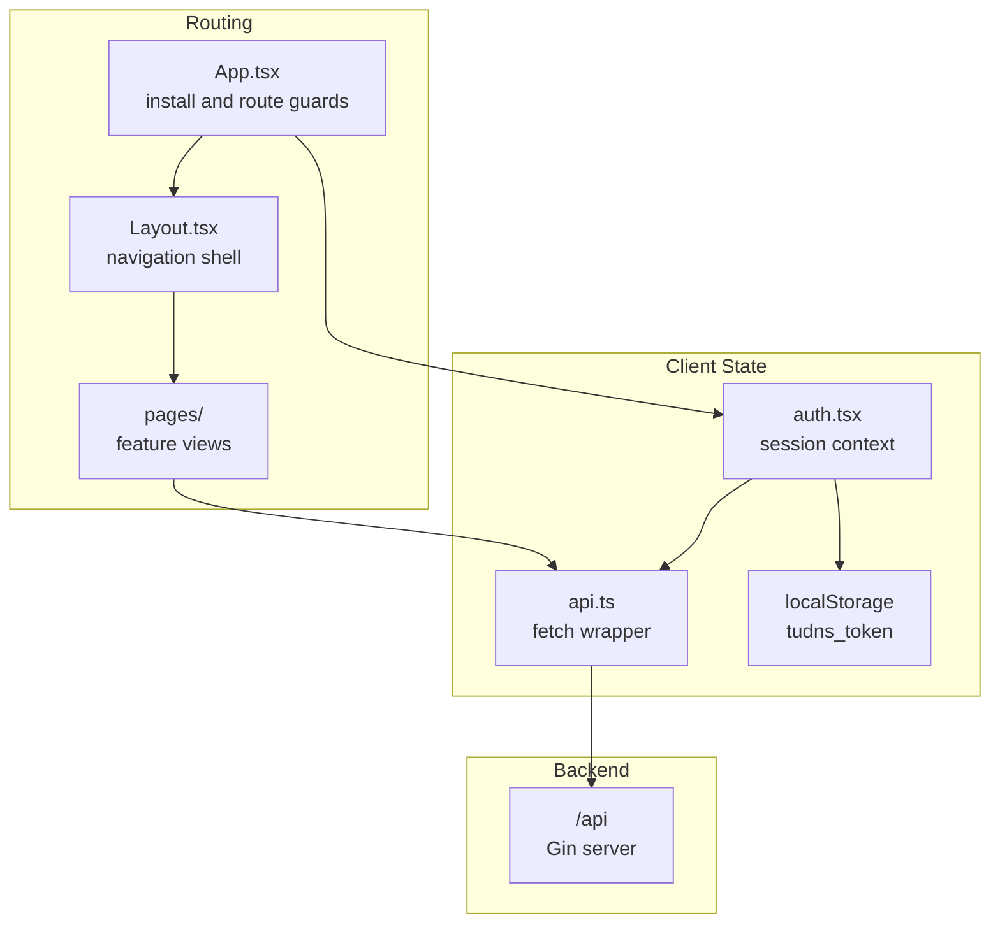

# 前端系统

> **Status**: release-ready  
> **Audience**: frontend developer, QA  
> **Scope**: React SPA 路由、认证、API 客户端与构建  
> **Last verified**: 2026-07-17 against working tree  
> **Owners**: TuDNS maintainers  
> **Related docs**: [架构](architecture.md)、[API](../API.md)

<cite>
**Files Referenced in This Document**
- [App.tsx](file://frontend/src/App.tsx) - 路由和守卫
- [Layout.tsx](file://frontend/src/components/Layout.tsx) - 应用框架
- [api.ts](file://frontend/src/lib/api.ts) - HTTP 客户端
- [auth.tsx](file://frontend/src/lib/auth.tsx) - 会话状态
- [vite.config.ts](file://frontend/vite.config.ts) - 开发代理和构建输出
</cite>

## Table of Contents
1. [Introduction](#introduction)
2. [Evidence Map](#evidence-map)
3. [Project Structure](#project-structure)
4. [Core Components](#core-components)
5. [Architecture Overview](#architecture-overview)
6. [Detailed Component Analysis](#detailed-component-analysis)
7. [Dependency and Boundary Analysis](#dependency-and-boundary-analysis)
8. [Runtime Contracts](#runtime-contracts)
9. [Data and Control Flow](#data-and-control-flow)
10. [Configuration and Operations](#configuration-and-operations)
11. [Security and Reliability](#security-and-reliability)
12. [Testing and Verification](#testing-and-verification)
13. [Extension and Maintenance](#extension-and-maintenance)
14. [Conclusion](#conclusion)

## Introduction

前端是 React 19 SPA，覆盖安装、登录注册、用户 DNS/积分以及管理员功能。开发时由 Vite 提供服务，生产时嵌入 Go 二进制。

**Section Sources**
- [package.json](file://frontend/package.json) - line range not verified
- [App.tsx](file://frontend/src/App.tsx) - line range not verified

## Evidence Map

| Topic | Primary evidence | What it proves |
| --- | --- | --- |
| 路由 | [App.tsx](file://frontend/src/App.tsx) | 页面与权限守卫 |
| 认证 | [auth.tsx](file://frontend/src/lib/auth.tsx) | Token、用户状态和刷新 |
| API | [api.ts](file://frontend/src/lib/api.ts) | envelope、Bearer 和错误处理 |
| 构建 | [vite.config.ts](file://frontend/vite.config.ts) | 代理与嵌入输出 |

## Project Structure

`src/pages` 按用户与 `admin` 页面分组，`components/Layout.tsx` 提供固定框架，`lib` 存放 API 和认证。当前没有独立测试目录、Storybook 或前端状态库。

**Section Sources**
- [frontend/src](file://frontend/src) - line range not verified

## Core Components

| Component | Role |
| --- | --- |
| `App` | 安装判断、路由和权限守卫 |
| `AuthProvider` | Token 驱动的用户会话 |
| `api` | JSON 请求、Bearer 注入和统一错误 |
| `Layout` | 导航、顶栏和 Outlet |
| pages | 用户和管理员业务视图 |

**Section Sources**
- [App.tsx](file://frontend/src/App.tsx) - line range not verified
- [auth.tsx](file://frontend/src/lib/auth.tsx) - line range not verified

## Architecture Overview

**Diagram Sources**
- [App.tsx](file://frontend/src/App.tsx) - line range not verified
- [auth.tsx](file://frontend/src/lib/auth.tsx) - line range not verified
- [api.ts](file://frontend/src/lib/api.ts) - line range not verified

**Section Sources**
- [App.tsx](file://frontend/src/App.tsx) - line range not verified

## Detailed Component Analysis

应用首先读取安装状态；未安装时所有路径重定向到 `/install`。安装后公开 `/login`、`/register`，其他页面要求用户；`admin/*` 还检查 `user.role === 'admin'`。后端仍是最终授权边界，前端守卫不能替代服务端检查。

**Section Sources**
- [App.tsx](file://frontend/src/App.tsx) - line range not verified

## Dependency and Boundary Analysis

Token 存储在 localStorage，任何同源 XSS 都可能读取它。API 客户端假设响应为 JSON envelope；支付宝通知等文本端点不应通过该客户端调用。

**Section Sources**
- [api.ts](file://frontend/src/lib/api.ts) - line range not verified

## Runtime Contracts

页面路由包括 `/install`、`/login`、`/register`、`/`、`/domains`、`/points` 和五个 `/admin/*` 页面。API 请求使用相对路径，以便开发代理和生产同源部署共享代码。

**Section Sources**
- [App.tsx](file://frontend/src/App.tsx) - line range not verified

## Data and Control Flow

登录/注册成功后保存 token 和 user；刷新页面时如果存在 token，调用 `/api/auth/me`。失败会清空 token。页面请求的 loading、empty 和 error 呈现由各页面自己管理，没有全局请求缓存。

**Section Sources**
- [auth.tsx](file://frontend/src/lib/auth.tsx) - line range not verified

## Configuration and Operations

Vite 开发端口为 5173，代理 `/api` 和 `/healthz` 到 8080。`npm run build` 同时运行 TypeScript project build 和 Vite，并直接输出到 `../internal/webembed/dist`。

**Section Sources**
- [vite.config.ts](file://frontend/vite.config.ts) - line range not verified
- [package.json](file://frontend/package.json) - line range not verified

## Security and Reliability

敏感值不应渲染到页面或控制台。当前没有 CSP 配置、自动 token 刷新、前端速率限制或独立 CSRF token；同源 Bearer 模式降低 cookie CSRF 风险，但仍需防 XSS 和限制 CORS。

**Section Sources**
- [api.ts](file://frontend/src/lib/api.ts) - line range not verified
- [router.go](file://internal/server/router.go) - line range not verified

## Testing and Verification

当前 `package.json` 只有 `dev`、`build`、`preview`，没有 lint/test/E2E 脚本。CI 通过 TypeScript 和生产构建验证；关键流程仍需浏览器人工或 Playwright 补充。

**Section Sources**
- [package.json](file://frontend/package.json) - line range not verified

## Extension and Maintenance

新增页面时更新 `App.tsx` 路由和 `Layout` 导航；新增 API 类型时避免 `any`，保持 envelope 处理集中在 `api.ts`。可访问性应检查键盘、标签、焦点和对比度。

**Section Sources**
- [App.tsx](file://frontend/src/App.tsx) - line range not verified

## Conclusion

前端结构适合当前规模；最优先的工程补齐是自动化测试、CSP/安全验证和更一致的页面错误状态。

**Section Sources**
- [frontend package](file://frontend/package.json) - line range not verified
