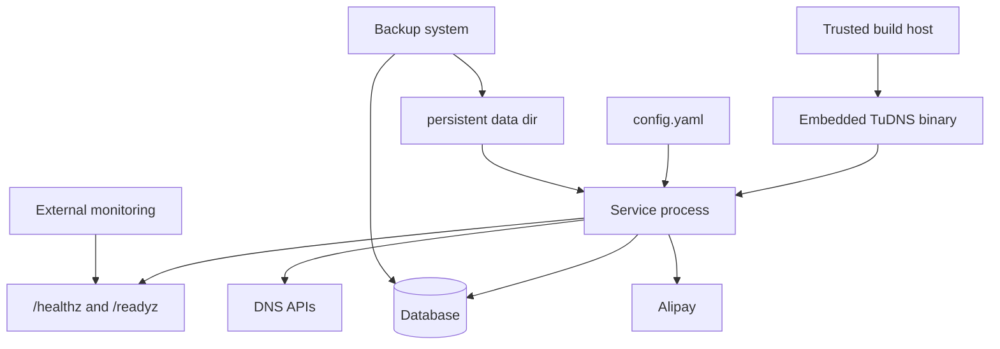

# 运维手册

> **Status**: release-ready  
> **Audience**: operator, developer  
> **Scope**: 构建、启动、健康、备份、升级与回滚  
> **Last verified**: 2026-07-17 against working tree  
> **Owners**: TuDNS maintainers  
> **Related docs**: [部署](../DEPLOY.md)、[故障排查](troubleshooting.md)

<cite>
**Files Referenced in This Document**
- [main.go](file://cmd/server/main.go) - 服务生命周期
- [router.go](file://internal/server/router.go) - 健康检查
- [build.sh](file://scripts/build.sh) - Unix 构建
- [build.ps1](file://scripts/build.ps1) - Windows 构建
- [config.go](file://internal/config/config.go) - 持久化文件
</cite>

## Table of Contents
1. [Introduction](#introduction)
2. [Evidence Map](#evidence-map)
3. [Project Structure](#project-structure)
4. [Core Components](#core-components)
5. [Architecture Overview](#architecture-overview)
6. [Detailed Component Analysis](#detailed-component-analysis)
7. [Dependency and Boundary Analysis](#dependency-and-boundary-analysis)
8. [Configuration and Operations](#configuration-and-operations)
9. [Security and Reliability](#security-and-reliability)
10. [Observability and Troubleshooting](#observability-and-troubleshooting)
11. [Testing and Verification](#testing-and-verification)
12. [Conclusion](#conclusion)

## Introduction

TuDNS 的运维单元是一个二进制、一个主配置和一个持久化数据目录。外部依赖是数据库、DNS API 和可选支付宝网关。

**Section Sources**
- [main.go](file://cmd/server/main.go) - line range not verified

## Evidence Map

| Topic | Primary evidence | What it proves |
| --- | --- | --- |
| 构建 | [build.sh](file://scripts/build.sh) | 前端后端构建顺序 |
| 启停 | [main.go](file://cmd/server/main.go) | 信号和 15 秒关闭窗口 |
| 健康 | [router.go](file://internal/server/router.go) | liveness/readiness 语义 |
| 持久化 | [config.go](file://internal/config/config.go) | 锁和数据库配置路径 |

## Project Structure

运行时只需要构建后的二进制、配置文件和可写数据目录；`frontend/` 与 Go 源码只在构建机需要。

**Section Sources**
- [embed.go](file://internal/webembed/embed.go) - line range not verified

## Core Components

| Artifact | Lifecycle |
| --- | --- |
| `bin/tudns*` | 不可变发布产物 |
| `config.yaml` | 部署配置与主密钥 |
| `data/database.yaml` | 安装生成的数据库参数 |
| `data/install.lock` | 安装完成标记 |
| 数据库 | 业务事实源 |

**Section Sources**
- [config.go](file://internal/config/config.go) - line range not verified

## Architecture Overview

**Diagram Sources**
- [main.go](file://cmd/server/main.go) - line range not verified
- [router.go](file://internal/server/router.go) - line range not verified

**Section Sources**
- [DEPLOY.md](file://DEPLOY.md) - line range not verified

## Detailed Component Analysis

进程在 SIGINT/SIGTERM 后给 HTTP 15 秒关闭时间，再关闭数据库连接。读取头超时 10 秒、读取 30 秒、写入 60 秒、空闲 120 秒。启动日志包含监听地址和安装状态。

**Section Sources**
- [main.go](file://cmd/server/main.go) - line range not verified

## Dependency and Boundary Analysis

服务不管理 TLS、数据库服务器、DNS 服务商和支付宝可用性。任何 Provider 操作都可能在第三方成功但本地后续失败，因此运维需要能在服务商控制台对账。

**Section Sources**
- [record service](file://internal/record/service.go) - line range not verified

## Configuration and Operations

构建、启动、备份、升级和回滚的命令见 [DEPLOY.md](../DEPLOY.md)。升级涉及 GORM 模型时必须先备份；主密钥轮换不可直接替换配置值，需先迁移所有受其保护的数据。

**Section Sources**
- [db.go](file://internal/db/db.go) - line range not verified
- [domain service](file://internal/domain/service.go) - line range not verified

## Security and Reliability

以非 root 专用账号运行，限制数据目录和配置读取权限，数据库走私网/TLS，前置 HTTPS 代理，Provider 使用最小权限。不要在探针或日志中输出密钥。

**Section Sources**
- [ENV_VARS.md](file://ENV_VARS.md) - line range not verified

## Observability and Troubleshooting

`healthz` 只证明进程响应，`readyz` 检查安装与数据库。没有内置指标/追踪，外部监控应采集 HTTP、进程、数据库和上游错误。排障矩阵见 [troubleshooting.md](troubleshooting.md)。

**Section Sources**
- [router.go](file://internal/server/router.go) - line range not verified

## Testing and Verification

发布前运行 CI 等价命令、启动新二进制并检查健康、登录、数据库读写和受控 Provider CRUD。支付验证只能在隔离商户/沙箱环境进行，不能用真实用户资金做烟雾测试。

**Section Sources**
- [ci.yml](file://.github/workflows/ci.yml) - line range not verified

## Conclusion

单二进制简化了交付，但生产稳定性仍依赖配置保护、数据库恢复、第三方对账和外部监控。

**Section Sources**
- [DEPLOY.md](file://DEPLOY.md) - line range not verified
