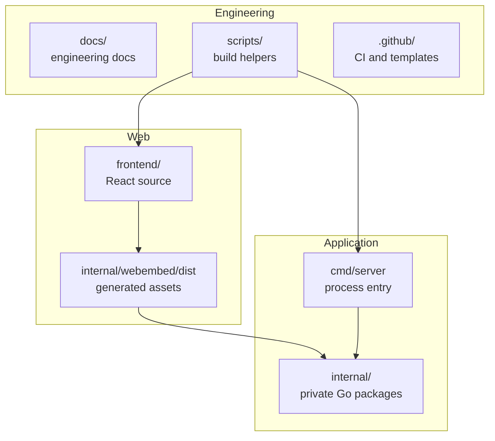

# 项目概览

> **Status**: release-ready  
> **Audience**: product, developer, operator  
> **Scope**: TuDNS 产品能力、仓库结构与交付边界  
> **Last verified**: 2026-07-17 against working tree  
> **Owners**: TuDNS maintainers  
> **Related docs**: [架构](architecture.md)、[DNS Provider](dns-providers.md)

<cite>
**Files Referenced in This Document**
- [server entry](file://cmd/server/main.go) - 进程生命周期
- [router](file://internal/server/router.go) - HTTP 能力边界
- [models](file://internal/models/models.go) - 核心数据对象
- [frontend routes](file://frontend/src/App.tsx) - 用户界面入口
</cite>

## Table of Contents
1. [Introduction](#introduction)
2. [Evidence Map](#evidence-map)
3. [Project Structure](#project-structure)
4. [Core Components](#core-components)
5. [Architecture Overview](#architecture-overview)
6. [Detailed Component Analysis](#detailed-component-analysis)
7. [Dependency and Boundary Analysis](#dependency-and-boundary-analysis)
8. [Runtime Contracts](#runtime-contracts)
9. [Security and Reliability](#security-and-reliability)
10. [Testing and Verification](#testing-and-verification)
11. [Conclusion](#conclusion)

## Introduction

TuDNS 面向需要分发自有根域名下二级域名的运营者。系统把用户、积分、域名商品、上游 DNS 和解析记录放在同一管理面中；它不提供权威 DNS 服务本身，而是调用第三方 DNS API。

**Section Sources**
- [router.go](file://internal/server/router.go) - line range not verified
- [provider.go](file://internal/dns/provider.go) - line range not verified

## Evidence Map

| Topic | Primary evidence | What it proves |
| --- | --- | --- |
| 进程与单二进制 | [main.go](file://cmd/server/main.go) | HTTP 生命周期与配置入口 |
| 业务 API | [router.go](file://internal/server/router.go) | 安装、用户、DNS、积分、管理功能 |
| 数据对象 | [models.go](file://internal/models/models.go) | 用户、域名、记录、账本、订单模型 |
| UI 路由 | [App.tsx](file://frontend/src/App.tsx) | 安装、用户和管理页面 |

## Project Structure

**Diagram Sources**
- [vite.config.ts](file://frontend/vite.config.ts) - line range not verified
- [embed.go](file://internal/webembed/embed.go) - line range not verified
- [build.sh](file://scripts/build.sh) - line range not verified

`cmd/` 和 `internal/` 遵循 Go 社区约定；`frontend/`、`docs/`、`scripts/`、`.github/` 是 GitHub 全栈仓库常见分区。生成资源不作为手写源码维护。

**Section Sources**
- [go.mod](file://go.mod) - line range not verified
- [package.json](file://frontend/package.json) - line range not verified

## Core Components

| Component | Responsibility | Failure modes |
| --- | --- | --- |
| `server` | 路由、中间件、服务装配、SPA | 数据库未安装、嵌入资源缺失 |
| `record` | 子域与记录 CRUD、计费、上游同步 | Provider 超时、本地与远端状态不一致 |
| `dns/providers` | 第三方 DNS API 适配 | 签名、权限、API 兼容性错误 |
| `points` | 积分账本 | 余额不足、业务号冲突 |
| `payment/alipay` | 下单、通知、积分入账 | 签名、回调、配置错误 |
| `frontend` | 安装、用户和管理 UI | API 不可达、Token 失效 |

**Section Sources**
- [router.go](file://internal/server/router.go) - line range not verified
- [record service](file://internal/record/service.go) - line range not verified

## Architecture Overview

系统是一个单进程控制面：浏览器调用 Gin API，服务使用 GORM 保存状态，并把 DNS 变更提交给外部 Provider。生产构建将 SPA 嵌入二进制，减少部署单元，但前后端必须按顺序构建。

**Section Sources**
- [db.go](file://internal/db/db.go) - line range not verified
- [embed.go](file://internal/webembed/embed.go) - line range not verified

## Detailed Component Analysis

首次安装创建管理员、保存数据库配置并写入安装锁。认证签发 JWT，受保护请求重新读取用户以检查禁用状态。域名配置中的 Provider 凭据使用主密钥加密；记录服务在数据库事务中执行扣费和本地写入，但第三方 API 不参与数据库事务，失败恢复只能尽力而为。

**Section Sources**
- [install service](file://internal/install/service.go) - line range not verified
- [auth middleware](file://internal/middleware/auth.go) - line range not verified
- [domain service](file://internal/domain/service.go) - line range not verified

## Dependency and Boundary Analysis

信任边界包括浏览器输入、数据库、文件系统、DNS 服务商和支付宝。数据库可替换为三种驱动，Provider 通过接口扩展；HTTP handler 与 service 当前集中在 `router.go`，规模增长后需要拆分以降低耦合。

**Section Sources**
- [provider.go](file://internal/dns/provider.go) - line range not verified
- [router.go](file://internal/server/router.go) - line range not verified

## Runtime Contracts

HTTP 合约见 [api.md](api.md)，配置见 [env-vars.md](env-vars.md)，安装与数据持久化见 [data-storage.md](data-storage.md)。应用仅支持一个进程入口，不提供后台任务或消息队列。

**Section Sources**
- [main.go](file://cmd/server/main.go) - line range not verified

## Security and Reliability

已实现 Bearer 认证、管理员授权、密码哈希、配置加密、请求超时和优雅关闭。尚无速率限制、指标和完整第三方联调；生产可用性取决于外围 TLS、备份和 Provider 验证。

**Section Sources**
- [main.go](file://cmd/server/main.go) - line range not verified
- [auth.go](file://internal/middleware/auth.go) - line range not verified

## Testing and Verification

后端运行 `go test ./... -count=1` 与 `go vet ./...`；前端运行 `npm ci && npm run build`；最终构建必须先生成嵌入资源。真实 DNS 与支付联调不属于离线测试覆盖范围。

**Section Sources**
- [ci.yml](file://.github/workflows/ci.yml) - line range not verified

## Conclusion

TuDNS 已形成可构建的全栈管理系统骨架，最重要的上线前工作是 Provider/支付宝真实联调、密钥与数据库保护、备份恢复演练和可观测性补齐。

**Section Sources**
- [README.md](file://README.md) - line range not verified
