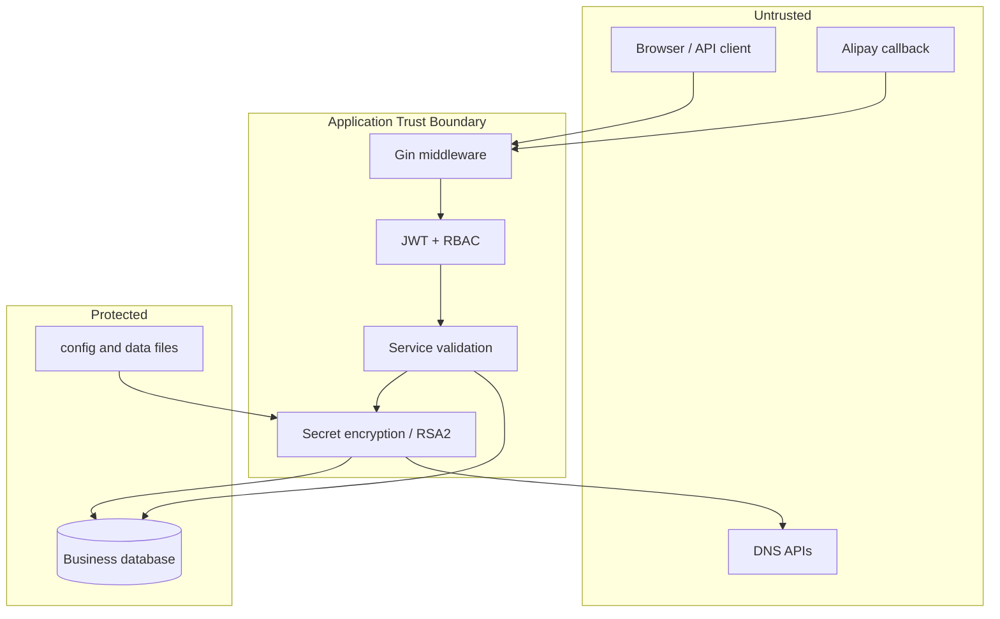

# 安全机制

> **Status**: release-ready  
> **Audience**: security reviewer, developer, operator  
> **Scope**: 认证、授权、密钥、输入边界和已知风险  
> **Last verified**: 2026-07-17 against working tree  
> **Owners**: TuDNS maintainers  
> **Related docs**: [安全策略](../SECURITY.md)、[部署](../DEPLOY.md)

<cite>
**Files Referenced in This Document**
- [auth middleware](file://internal/middleware/auth.go) - Bearer 与管理员授权
- [password.go](file://internal/auth/password.go) - 密码哈希
- [secret.go](file://internal/secret/secret.go) - Provider 配置加密
- [router.go](file://internal/server/router.go) - 路由与安全头
- [alipay service](file://internal/payment/alipay/service.go) - RSA2 与模拟支付
</cite>

## Table of Contents
1. [Introduction](#introduction)
2. [Evidence Map](#evidence-map)
3. [Project Structure](#project-structure)
4. [Core Components](#core-components)
5. [Architecture Overview](#architecture-overview)
6. [Detailed Component Analysis](#detailed-component-analysis)
7. [Dependency and Boundary Analysis](#dependency-and-boundary-analysis)
8. [Runtime Contracts](#runtime-contracts)
9. [Security and Reliability](#security-and-reliability)
10. [Observability and Troubleshooting](#observability-and-troubleshooting)
11. [Testing and Verification](#testing-and-verification)
12. [Conclusion](#conclusion)

## Introduction

受保护资产包括账号、积分、DNS Zone 控制权、Provider 凭据、数据库 DSN 和支付宝密钥。主要攻击面是公开 HTTP API、安装流程、浏览器 Token、外部回调和第三方 API。

**Section Sources**
- [router.go](file://internal/server/router.go) - line range not verified

## Evidence Map

| Topic | Primary evidence | What it proves |
| --- | --- | --- |
| 认证授权 | [auth.go](file://internal/middleware/auth.go) | Bearer、用户状态、admin 检查 |
| 密码 | [password.go](file://internal/auth/password.go) | bcrypt 实现 |
| Provider 密文 | [secret.go](file://internal/secret/secret.go) | 加解密边界 |
| 支付签名 | [service.go](file://internal/payment/alipay/service.go) | RSA2 签名和通知验证 |

## Project Structure

安全逻辑分布在 `auth`、`middleware`、`secret`、`server` 和 `payment`。没有独立 WAF、rate-limit 或策略引擎模块。

**Section Sources**
- [internal](file://internal) - line range not verified

## Core Components

| Control | Behavior | Limitation |
| --- | --- | --- |
| JWT Bearer | 校验签名并重新加载用户 | Token 存 localStorage，无撤销表 |
| AdminOnly | 检查数据库用户角色 | 仅两级路由授权模型 |
| bcrypt | 密码不可逆哈希 | 最低密码长度仅 6 |
| Provider encryption | 主密钥加密数据库密文 | 主密钥兼作 JWT 密钥 |
| RSA2 | 支付参数签名/通知验签 | 真实商户环境未验证 |
| Security headers | nosniff、DENY frame | 无 CSP/HSTS |

**Section Sources**
- [auth.go](file://internal/middleware/auth.go) - line range not verified
- [router.go](file://internal/server/router.go) - line range not verified

## Architecture Overview

**Diagram Sources**
- [router.go](file://internal/server/router.go) - line range not verified
- [auth.go](file://internal/middleware/auth.go) - line range not verified
- [domain service](file://internal/domain/service.go) - line range not verified

**Section Sources**
- [router.go](file://internal/server/router.go) - line range not verified

## Detailed Component Analysis

Bearer 中间件拒绝缺失/无效 token、缺失用户和禁用用户。管理员路由再次检查角色。域名配置先 JSON 序列化再加密；读取时解密并传给 Provider。支付宝仅在公钥和签名同时存在时验签，因此生产必须确保配置完整。

**Section Sources**
- [auth.go](file://internal/middleware/auth.go) - line range not verified
- [domain service](file://internal/domain/service.go) - line range not verified
- [alipay service](file://internal/payment/alipay/service.go) - line range not verified

## Dependency and Boundary Analysis

应用信任配置文件中的主密钥、数据库中的用户/角色和 Provider 密文。公网 DNS 与支付宝响应不可信，必须通过 TLS、签名和业务字段校验。当前支付通知对金额字段仅读取未核对，属于生产上线前必须评估的风险。

**Section Sources**
- [alipay service](file://internal/payment/alipay/service.go) - line range not verified

## Runtime Contracts

生产要求 HTTPS 由外围代理提供、CORS 限制可信 Origin、模拟支付不可用、安装入口不再可执行、数据目录仅服务账号可访问。代码当前未强制这些部署条件。

**Section Sources**
- [config example](file://config.example.yaml) - line range not verified
- [router.go](file://internal/server/router.go) - line range not verified

## Security and Reliability

已知缺口：无速率限制；安装 `install_token` 未用于路由；模拟支付路由公开；支付通知金额未严格核对；无 CSP/HSTS；Token 在 localStorage；缺少集中审计告警。生产部署必须先做威胁建模和专项审计。

**Section Sources**
- [config.go](file://internal/config/config.go) - line range not verified
- [alipay service](file://internal/payment/alipay/service.go) - line range not verified

## Observability and Troubleshooting

Gin 与 GORM 日志可用于发现认证、数据库和上游错误，但必须防止记录凭据、Token、DSN 与支付表单。当前没有安全指标或告警规则。

**Section Sources**
- [router.go](file://internal/server/router.go) - line range not verified
- [db.go](file://internal/db/db.go) - line range not verified

## Testing and Verification

安全验证至少包括越权矩阵、禁用用户、伪造 JWT、输入边界、Provider 密文、支付签名、依赖漏洞和密钥扫描。仓库现有离线测试不能替代渗透测试与真实支付回调验证。

**Section Sources**
- [auth tests](file://internal/auth/password_test.go) - line range not verified
- [secret tests](file://internal/secret/secret_test.go) - line range not verified

## Conclusion

现有控制适合作为开发基线，不应仅凭编译和单测宣称生产安全；支付、安装保护、速率限制和浏览器会话是优先整改面。

**Section Sources**
- [SECURITY.md](file://SECURITY.md) - line range not verified
