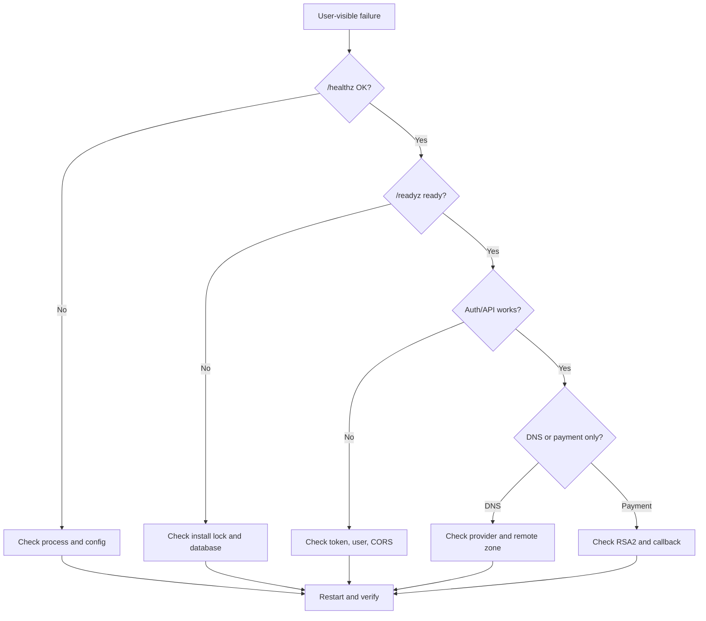

# 故障排查

> **Status**: release-ready  
> **Audience**: operator, developer  
> **Scope**: 启动、安装、数据库、前端、DNS 和支付常见故障  
> **Last verified**: 2026-07-17 against working tree  
> **Owners**: TuDNS maintainers  
> **Related docs**: [运维](operations.md)、[DNS Provider](dns-providers.md)

<cite>
**Files Referenced in This Document**
- [main.go](file://cmd/server/main.go) - 启动错误
- [router.go](file://internal/server/router.go) - 健康和 API 错误
- [db.go](file://internal/db/db.go) - 数据库错误
- [record service](file://internal/record/service.go) - DNS 错误
- [vite.config.ts](file://frontend/vite.config.ts) - 前端开发代理
</cite>

## Table of Contents
1. [Introduction](#introduction)
2. [Evidence Map](#evidence-map)
3. [Project Structure](#project-structure)
4. [Core Components](#core-components)
5. [Architecture Overview](#architecture-overview)
6. [Detailed Component Analysis](#detailed-component-analysis)
7. [Dependency and Boundary Analysis](#dependency-and-boundary-analysis)
8. [Observability and Troubleshooting](#observability-and-troubleshooting)
9. [Testing and Verification](#testing-and-verification)
10. [Conclusion](#conclusion)

## Introduction

排障顺序应从进程、配置、安装锁、数据库、认证逐步进入第三方 DNS/支付，避免直接在生产 Provider 上反复写操作。

**Section Sources**
- [main.go](file://cmd/server/main.go) - line range not verified

## Evidence Map

| Topic | Primary evidence | What it proves |
| --- | --- | --- |
| 启动 | [main.go](file://cmd/server/main.go) | 配置/数据库 fatal 路径 |
| readiness | [router.go](file://internal/server/router.go) | not_installed/no_db/db 原因 |
| SQLite | [db.go](file://internal/db/db.go) | 路径、WAL 与 timeout |
| DNS | [record service](file://internal/record/service.go) | 上游错误包装 |

## Project Structure

重点检查 `config.yaml`、`data/`、二进制、服务日志和外部平台控制台。源码开发再检查 `frontend/` 和 `internal/webembed/dist/`。

**Section Sources**
- [.gitignore](file://.gitignore) - line range not verified

## Core Components

| Symptom | Likely cause | Evidence | Safe fix | Escalate when |
| --- | --- | --- | --- | --- |
| 启动时报配置错误 | YAML 路径/语法错误 | `TUDNS_CONFIG`、启动日志 | 用示例重建并保留主密钥 | 配置正确仍无法加载 |
| `/readyz` 为 `not_installed` | 无 `install.lock` | `data/install.lock` | 完成安装或恢复成套备份 | 数据库已有业务数据但锁丢失 |
| `/readyz` HTTP 503 | DB 不可达 | `database.yaml`、DB 日志 | 修复网络/凭据后重启 | 恢复可能引发数据损失 |
| 页面显示 API 正在运行 | 未嵌入前端 | `internal/webembed/dist` | 先 `npm run build` 再构建 Go | CI 二进制仍缺页面 |
| Vite 页面 API 失败 | 后端 8080 未运行 | `/healthz` | 启动后端，检查代理端口 | 代理配置未改仍失败 |
| 登录反复失效 | secret 变更、Token 过期、用户禁用 | 配置和用户状态 | 重新登录；恢复正确 secret | Provider 密文也无法解密 |
| DNS 创建失败 | 凭据、权限、Zone、TTL/线路错误 | 服务日志、平台控制台 | 在测试 Zone 检测连接并修正 | 远端已成功但本地无记录 |
| DNS 删除后仍解析 | 远端删除失败被忽略或缓存 | 平台记录与 TTL | 控制台核对并手工清理 | 出现跨用户记录 |
| 支付订单不入账 | 回调/签名/配置错误 | 订单、回调日志 | 在沙箱重放脱敏回调 | 金额或签名不一致 |

**Section Sources**
- [router.go](file://internal/server/router.go) - line range not verified
- [record service](file://internal/record/service.go) - line range not verified

## Architecture Overview



**Diagram Sources**
- [router.go](file://internal/server/router.go) - line range not verified
- [main.go](file://cmd/server/main.go) - line range not verified

**Section Sources**
- [operations.md](file://docs/operations.md) - line range not verified

## Detailed Component Analysis

配置错误会在启动阶段终止进程；数据库错误可能在启动或 readiness 暴露；业务错误通过统一 envelope 返回。DNS 错误前缀包含“上游 DNS”，应同时核对本地记录和平台控制台。

**Section Sources**
- [main.go](file://cmd/server/main.go) - line range not verified
- [response.go](file://internal/response/response.go) - line range not verified

## Dependency and Boundary Analysis

外部故障可能来自 DNS API、支付宝、数据库网络、代理或浏览器。不要把第三方超时简单归因于应用；也不要因远端成功就忽略本地事务状态。

**Section Sources**
- [record service](file://internal/record/service.go) - line range not verified

## Observability and Troubleshooting

诊断命令：

```bash
curl -i http://127.0.0.1:8080/healthz
curl -i http://127.0.0.1:8080/readyz
go test ./... -count=1
cd frontend && npm run build
```

收集日志时删除 Authorization、DSN、Provider 配置、支付私钥和回调表单敏感字段。恢复操作前备份当前数据库与配置。

**Section Sources**
- [router.go](file://internal/server/router.go) - line range not verified

## Testing and Verification

修复后从最窄范围验证，再运行全套测试。DNS/支付问题使用隔离环境；涉及数据恢复时先在副本演练。若问题反复出现，应记录时间、请求类型、平台 request ID 和脱敏错误。

**Section Sources**
- [ci.yml](file://.github/workflows/ci.yml) - line range not verified

## Conclusion

先确认本地健康与数据一致性，再处理外部集成；任何可能影响真实 DNS 或资金的修复都必须使用隔离环境和可回滚步骤。

**Section Sources**
- [SECURITY.md](file://SECURITY.md) - line range not verified
